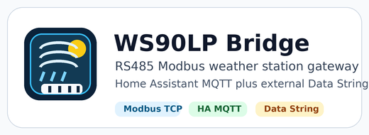

# WS90LP Modbus Bridge Add-on Repository



[](https://my.home-assistant.io/redirect/supervisor_store/?repository_url=https%3A%2F%2Fgithub.com%2Fdeltasystems-pl%2Fweather_modbus_converter-addon)

Home Assistant add-on repository URL:

```text
https://github.com/deltasystems-pl/weather_modbus_converter-addon
```

This repository contains **WS90LP Modbus Bridge**, a Home Assistant add-on for wired WS90LP/WN90LP weather stations.

The add-on runs one supervised service that owns the full path:

```text
WS90LP RS485 Modbus -> bridge add-on -> Home Assistant MQTT entities
                                  -> optional external MQTT payload
```

It polls the station through an RS485-to-Ethernet adapter, decodes live Modbus registers, calculates derived weather and rain values, publishes Home Assistant MQTT discovery/state, serves a Home Assistant sidebar weather analysis app, and can also send an ESPHome-compatible `data_string` payload to an external MQTT broker.

## Why Use This Add-on

- One service owns Modbus polling, derived values, Home Assistant updates, and external MQTT output.
- No AppDaemon, Node-RED, template sensors, and second poller chain required.
- Designed for the Waveshare RS485 TO ETH (B) using `modbus_tcp_gateway`.
- Publishes Home Assistant MQTT discovery for automatic entity creation.
- Adds a **Pogoda** ingress app that can be shown in the Home Assistant sidebar.
- Publishes external MQTT as `json`, `data_string`, or `ecowitt`.
- Calculates sea-level pressure, wind direction text, solar radiation, feels-like values, and rain periods.

## Install

1. Open Home Assistant.
2. Go to **Settings -> Add-ons -> Add-on Store**.
3. Open the three-dot menu and choose **Repositories**.
4. Add:

```text
https://github.com/deltasystems-pl/weather_modbus_converter-addon
```

5. Install **WS90LP Modbus Bridge**.

## Recommended Configuration

For the Waveshare RS485 TO ETH (B):

```yaml
protocol_mode: modbus_tcp_gateway
live_read_mode: block
host: 192.168.88.201
port: 502
unit_id: 144
poll_interval_seconds: 10
timeout_seconds: 3
failure_threshold: 3
log_level: INFO
station_elevation_m: 188.0

mqtt:
  host: core-mosquitto
  port: 1883
  username: ""
  password: ""
  discovery_prefix: homeassistant
  base_topic: ws90lp_bridge/ws90lp
  client_id: ws90lp_bridge

external_mqtt:
  enabled: true
  host: example-broker.local
  port: 1883
  username: ""
  password: ""
  client_id: ws90lp_bridge_external
  topic: okrweather/ws90-gw2000a-02
  payload_format: data_string
  interval_seconds: 60
  retain: false

web_ui:
  enabled: true
  host: 0.0.0.0
  port: 8099
  title: Pogoda
  language: pl
  history_limit: 720
```

If the adapter cannot handle the 10-register block read, change only:

```yaml
live_read_mode: single
```

## Sidebar Weather App

The add-on supports Home Assistant ingress. On the add-on **Info** page, enable **Show in sidebar** to add **Pogoda** to the Home Assistant sidebar.

The page is served by the same supervised add-on process that polls Modbus. It visualizes live station data with current conditions, wind direction, rain periods, sun/UV, pressure, trend charts, and raw diagnostics. It does not write Lovelace YAML, does not modify `configuration.yaml`, and does not require HACS cards.

Set `web_ui.language` to `pl` or `en`. The explicit `/pl` and `/en` routes are also available.

## Documentation

See the add-on documentation page after installation, or read:

- [Full add-on documentation](ws90lp_modbus_bridge/DOCS.md)
- [Changelog](ws90lp_modbus_bridge/CHANGELOG.md)
